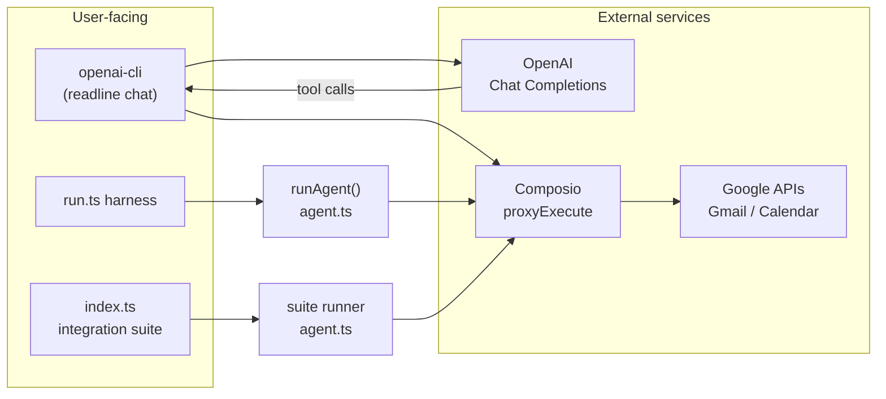
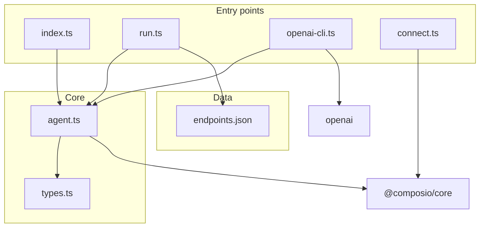
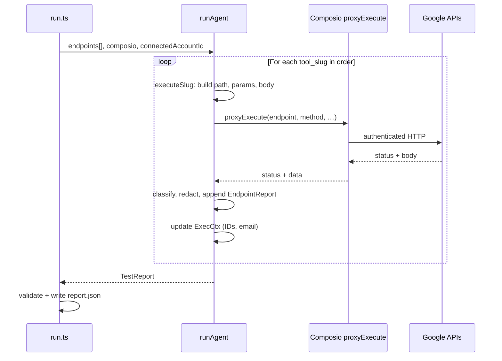
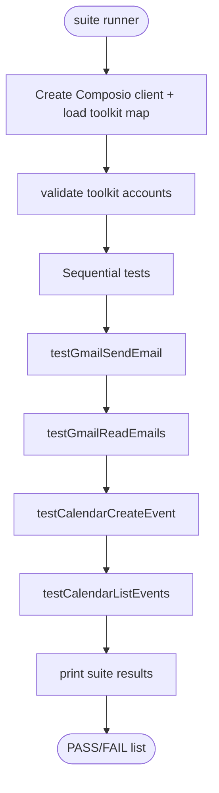
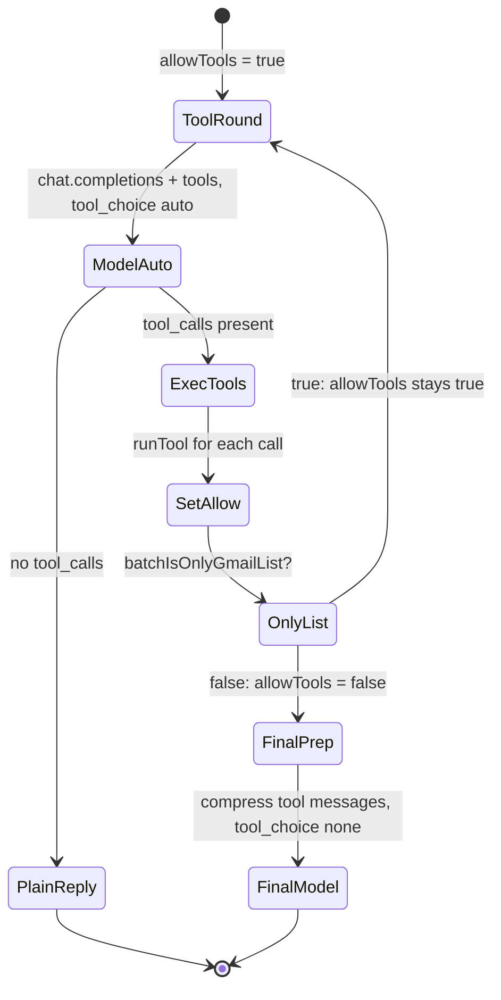
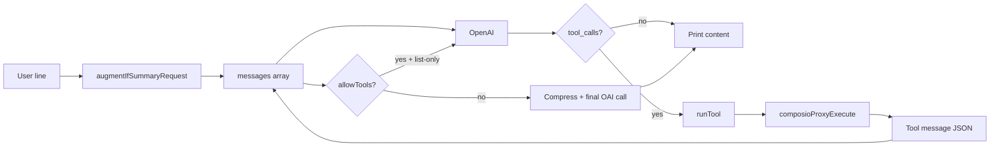

# Endpoint Tester — Architecture & Design

This repository combines two related capabilities:

1. **Endpoint executability validation** — Given structured API endpoint definitions (Gmail + Google Calendar in the sample), the agent calls each through Composio’s authenticated proxy and classifies whether the call succeeded, failed due to missing routes/scopes, or failed for other reasons.
2. **Natural-language assistant** — A separate CLI uses OpenAI tool-calling to drive the **same** Composio proxy layer for real Gmail and Calendar actions (list/read/send mail, list/create calendar events).

The sections below describe **high-level design (HLD)**, **low-level design (LLD)**, and **workflows** in plain language. Setup steps and environment variables are intentionally omitted here.

---

## 1. High-level design (HLD)

### 1.1 System context

At a high level, everything sits between **your code**, **OpenAI** (only for the chat CLI), and **Google APIs** — with **Composio** in the middle holding OAuth tokens and exposing a single `proxyExecute` surface.

**Idea:** One **shared integration layer** in `agent.ts` (`composioProxyExecute`, account routing, path normalization) so the **integration tests**, the **batch endpoint report**, and the **OpenAI CLI** never duplicate OAuth or URL quirks.

### 1.2 Major subsystems

| Subsystem | Role |
|-----------|------|
| **Composio client** | Created once; all HTTP to Gmail/Calendar goes through `tools.proxyExecute` with a **connected-account id** per toolkit. |
| **Toolkit account map** | Resolves **Gmail** vs **Google Calendar** connection IDs — they are usually **different** nanoids for the same human user. |
| **Proxy routing** | `pickConnectedAccountId` chooses the correct id from the request path prefix (`/gmail/` vs `/calendar/`…). |
| **Calendar path normalization** | Composio’s Calendar toolkit already uses a base URL that includes `/calendar/v3`. Callers pass full-style paths; `normalizeProxyEndpoint` strips the duplicate segment to avoid `404` from doubled paths. |
| **Endpoint harness (`runAgent`)** | Iterates endpoint definitions, builds minimal requests, tracks **dependency context** (message IDs, event IDs), classifies HTTP outcomes into `TestReport` statuses. |
| **OpenAI CLI (`openai-cli.ts`)** | Declares function tools, runs a **multi-round** chat loop, executes tools via `composioProxyExecute`, then a **final** model pass with `tool_choice: "none"` to produce user-visible text. |

### 1.3 Design principles

- **Single source of truth for API access** — `composioProxyExecute` is the only gateway from assistant/tests to Google.
- **Explicit calendar create policy** — Creating events requires **confirmed timing** (`user_confirmed_timing` + server-side checks) so the model does not invent times.
- **Context safety** — Large Gmail bodies and tool JSON are **shrunk** before the final LLM call so requests stay within limits and JSON stays **valid** (especially for calendar lists).

---

## 2. Low-level design (LLD)

### 2.1 Module map

| File | Responsibility |
|------|----------------|
| `types.ts` | `EndpointDefinition`, `EndpointReport`, `TestReport`, `EndpointStatus` — contract for the harness output. |
| `endpoints.json` | List of endpoints (method, path, parameters, scopes) fed to `runAgent`. |
| `run.ts` | Loads endpoints, invokes `runAgent`, validates report shape, writes `report.json`. **Not** meant to be modified for solutions. |
| `agent.ts` | Composio helpers, `runAgent`, integration suite runner (Gmail/Calendar checks from `index.ts`), Gmail/Calendar test helpers, `executeSlug` + classification + redaction. |
| `openai-cli.ts` | OpenAI tools schema, `runTool`, `chatTurn`, compression helpers, system prompt. |
| `connect.ts` | OAuth link flow to obtain connected-account IDs (used operationally; not part of the diagram’s “core logic” loop). |

### 2.2 `ToolkitAccountMap` and routing

**Data shape:**

- `gmail?: string` — Composio **connected account** id for the Gmail toolkit.
- `googlecalendar?: string` — Connected account id for Calendar.

**Resolution order (conceptual):** environment overrides first, then listing active connections for `COMPOSIO_USER_ID` if needed.

**Routing rule:** the **HTTP path prefix** of the proxied request decides which id is passed to `proxyExecute`. Paths that look like Calendar (including normalized forms) use the Calendar id; `/gmail/` uses the Gmail id; anything else falls back to a legacy default label.

### 2.3 Calendar path normalization (LLD detail)

Callers may express endpoints as `/calendar/v3/calendars/...`. The proxy already sits under a base that includes `/calendar/v3`. The normalizer:

- Maps `/calendar/v3` → `/`
- Strips the `/calendar/v3` prefix from longer paths so the final request is not `/calendar/v3/calendar/v3/...`

This is **transparent** to `runAgent` and `openai-cli` as long as they use the shared `composioProxyExecute` entry point.

### 2.4 Endpoint testing: `ExecCtx` and `RUN_ORDER`

`runAgent` keeps a mutable **`ExecCtx`** while iterating slugs:

- Stores **user email** from profile when available.
- Stores **list message id**, **sent message id**, **event ids** from list/create responses so path parameters like `{messageId}` or `{eventId}` can be filled for dependent calls.

**Order:** A fixed `RUN_ORDER` array defines a **dependency-friendly** sequence (profile → list → get → … → send → … → calendar create → get → delete). Any endpoint not in that list is still appended so nothing is dropped.

For each slug, `executeSlug`:

1. Substitutes path placeholders from `ExecCtx`.
2. Builds query/header parameters and body **per slug** (minimal valid payloads for send, draft, create event, etc.).
3. Calls `toolProxy` / `composioProxyExecute`.
4. Updates `ExecCtx` from successful responses (IDs, email).

### 2.5 Classification (`classifyStatus`)

HTTP status drives coarse **endpoint status**:

- **2xx** → `valid`
- **404** (and similar “not found” semantics) → `invalid_endpoint`
- **403** (and forbidden-style cases) → `insufficient_scopes`
- **Other** → `error`

Responses are **truncated** and **redacted** before landing in `response_body` in the report.

### 2.6 OpenAI CLI: tools and `chatTurn`

**Tools** map 1:1 to `runTool` branches: profile, list messages, get message (with simplified “full” payload for summaries), send email, list events, create event.

**`batchIsOnlyGmailList`:** If the model’s tool batch is **only** `gmail_list_messages`, another round with `tool_choice: "auto"` is allowed so the model can call `gmail_get_message` next. For calendar-only or mixed batches, **`allowTools`** becomes false after executing tools once.

**Final phase:** When `allowTools` is false, the loop **does not** send another tool round first; it:

1. Runs `compressToolMessagesForFinalLlm` — shrinks Gmail `body_text`, and for oversized JSON, **reduces `data.items` for calendar** instead of corrupting JSON with a blind string slice.
2. Calls the model with `tool_choice: "none"` (non-stream with timeout, then streaming fallback).

**Calendar list:** Successful responses pass through `simplifyCalendarListData` (trim each event to essential fields). **Create:** Rejected unless `user_confirmed_timing === true` in addition to model-provided ISO start/end.

---

## 3. Workflows

### 3.1 Endpoint report generation (`bun src/run.ts`)

### 3.2 Integration suite (`bun src/index.ts`)

This path is **narrower** than `runAgent`: a fixed set of integration checks (send, read, create event, list events) for quick PASS/FAIL feedback.

### 3.3 OpenAI chat CLI (`bun run ai`)

**Narrative:** The user types a line → messages = system + user → the model may call tools → tools run against Composio → results append as `role: tool` → either another **tool round** (list-only Gmail case) or **one final** natural-language reply without further tools.

### 3.4 Data flow: one user request in the CLI

---

## 4. Cross-cutting concerns

| Concern | Approach |
|---------|----------|
| **Timeouts** | Wrapped OpenAI calls with `withTimeout`; final stream uses `AbortController` and a ceiling (e.g. 120s). |
| **Large contexts** | `clip` on tool strings; `shrinkGmailToolResult` for bodies; calendar list simplification + `shrinkToolJsonToHardCap` for the final pass. |
| **Safety (calendar create)** | Model must pass `user_confirmed_timing: true`; `runTool` rejects create if not true. |
| **Reporting** | `TestReport.summary` counts must match the four status buckets across all `results` entries. |

---

## 5. Glossary

| Term | Meaning |
|------|---------|
| **Connected account id** | Composio’s id for a linked OAuth identity for a **specific toolkit** (not the same as a free-form “user label”). |
| **proxyExecute** | Composio method: authenticated proxy to vendor HTTP APIs using stored tokens. |
| **tool_slug** | Stable name for one row in `endpoints.json` and one row in the report. |
| **EndpointStatus** | `valid` \| `invalid_endpoint` \| `insufficient_scopes` \| `error`. |

---

## 6. Related files

| Topic | Where to look |
|-------|----------------|
| Report types | `src/types.ts` |
| Proxy + `runAgent` + suite | `src/agent.ts` |
| Chat tools + loop | `src/openai-cli.ts` |
| Harness validation | `src/run.ts` |
| Sample endpoint list | `src/endpoints.json` |

This document describes **structure and behavior**. Operational setup is out of scope for this README.
